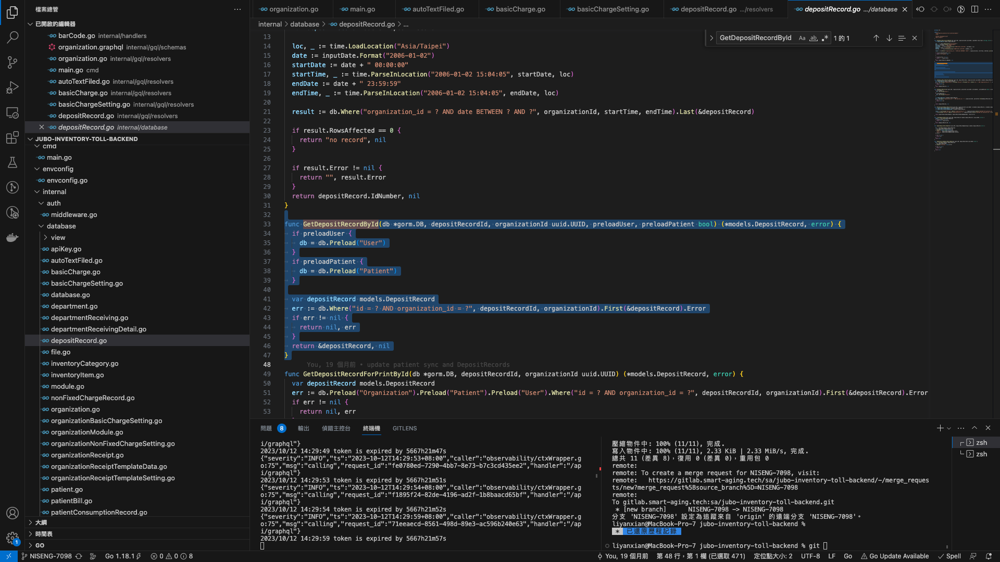
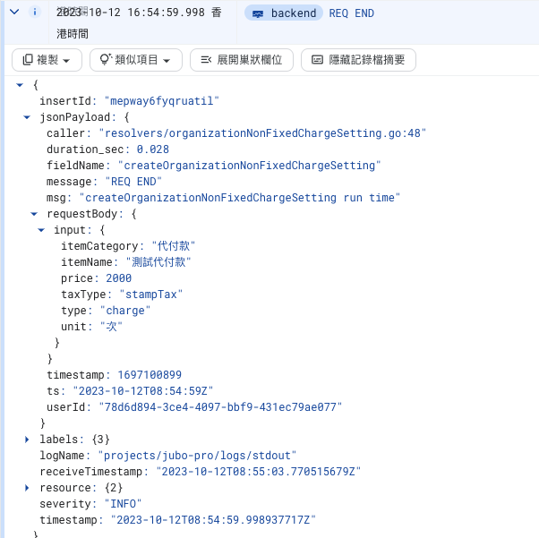

# 此後端 graphql 和 restful 為並存的,先說明 graphql

## graphql 部分

### 設定 env
此專案中並沒有使用.env,而是用 envconfig/envconfig.go 取代(這邊要注意一下 env 裡面的 HTTPPort 記得要用 4000 不然 GraphQL 可能會遇到其他的小麻煩)


確認 database/main 裡面的變數 databaseConnect 和本機端一樣(帳號,密碼,資料庫名稱,port...等)

### How to modify schema

1. 修改 `internal/gql/schemas` (還不確定的可以先放在 schema.graphql 裡 未來再獨立成一個檔案)
2. 修改 `internal/models`
3. 修改 `gqlgen.yml`
4. `make graph-build` (這一步很重要 它會透過 schema.graphql 跟 gqlgen.yml,進而生成三個檔案(exec 跟兩個 generated))
5. 實作階段,可以參考 basicChargeSetting.graphql 裡面的 BasicChargeSetting(相關 type 及 function),resolvers/basicChargeSetting 和 models/basicChargeSetting 裡面有新增,更新和查詢的實作

### 執行方式

0. 要跟 SRE 或是收庫開發者拿一份 inventory-toll-file-upload.sa.json 的檔案(這個檔案要無法公開,主要是資安和權限的問題),未來請其他開發者不要推到 git 上(如果沒有json檔又真的很想執行可以把列印相關的功和go:embed的部分一起拔掉原則上就可以執行了)  
1. `make run`
2. 用網頁打開 http://localhost:4000
3. 有正常的打開看到以下畫面基本上就畢業了,可以再試試看新增 api 有沒有正常的把資料寫入資料庫  



### gcpLog

本系統操作的 Log 都有留存於 gcp 上,大概是長這樣子  
介紹一下會看到的內容

1. duration_sec 為執行時長
2. fieldName 為 GraphQL 的 fieldName,可以理解成一個 router
3. message 就是一些資訊
4. timestamp 為執行時間
5. requestBody 就是前端傳給後端的 body  



### 測試內容

這邊主要是因為住民帳單在算錢的時候會一直算應繳金額,因為怕算錯,所以寫了一些測試,總共分成固定費用+補助款+異動+非固定費用  
指令是 `make test-coverage`
目前異動的量因為比較大,所以在跑的時候連線數有可能會炸掉,如果有看到類似的下面的訊息那就出事了  
`` failed to initialize database, got error failed to connect to `xxxxxxx`  `` 或是 `server error (FATAL: sorry, too many clients already (SQLSTATE 53300))`  
可以先用下面的指令確認一下最大連線數,原則上正常人的 default 應該都是 100

```sql
SHOW max_connections
```

再來就用下面的指令增加一下上限數量

```sql
ALTER system SET max_connections=150
```

執行完之後記得要重啟 postgresql 才會有效  
reference:https://linuxhint.com/tuning-postgres-max-connections/

可以開cover.html看有哪些部分有被覆蓋到

## resetful 部分

### 登入實作

主要方式為走 oauth,入口為 main.go 其會呼叫 internal/restful/router 內的 function,router 會在呼叫其他 service 的 function,完成 restful api 的實作

### api 權限

目前所有的 graphql api,都會檢查登入後的 token,實作在 auth/middleware

## 資料庫

### postgresql 設定
1. docker pull postgres:14.9
2. docker run -d --name postgres -p 5432:5432 -e POSTGRES_PASSWORD=test -e POSTGRES_USER=test  -e POSTGRES_DB=localTest2 postgres:14.9
3. docker cp ./backup.sql postgres:/file.sql
4. docker exec -u postgres postgres psql localTest2 postgres -f /file.sql

### 匯出資料
pg_dump -U postgres -d test123 -f test123.sql
### 匯入資料
psql -U postgres -d test123 -f test123.sql 


### 結語
可能很多人對GraphQL不太熟悉,如果想瞭解也可以看看這些文章  
[why-use-GraphQL](https://ithelp.ithome.com.tw/articles/10286331)  
[GraphQL介紹及教學](https://ithelp.ithome.com.tw/articles/10285159)  

